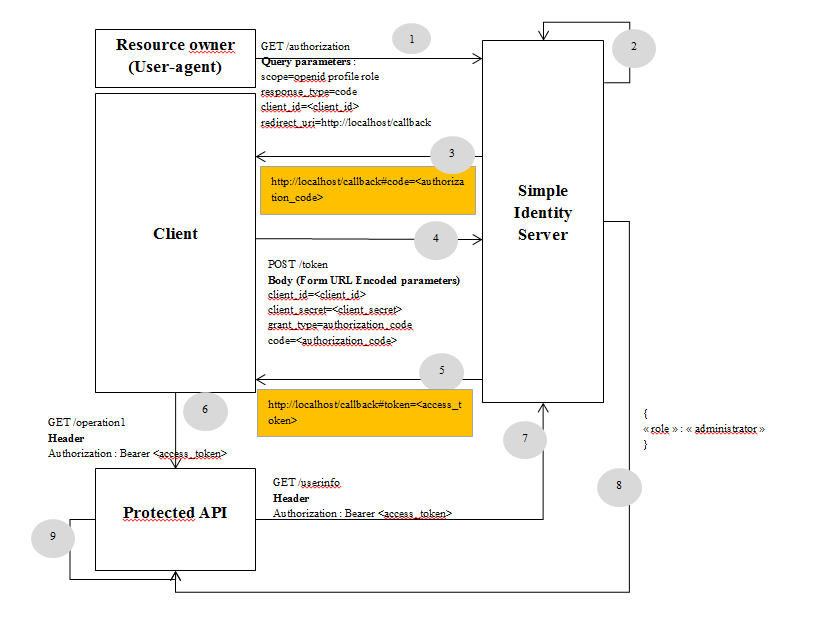
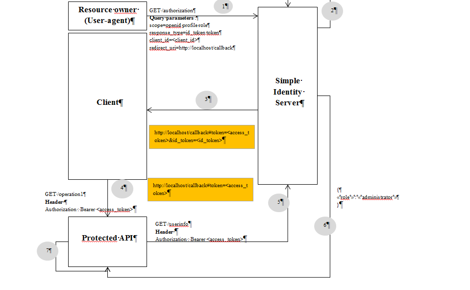
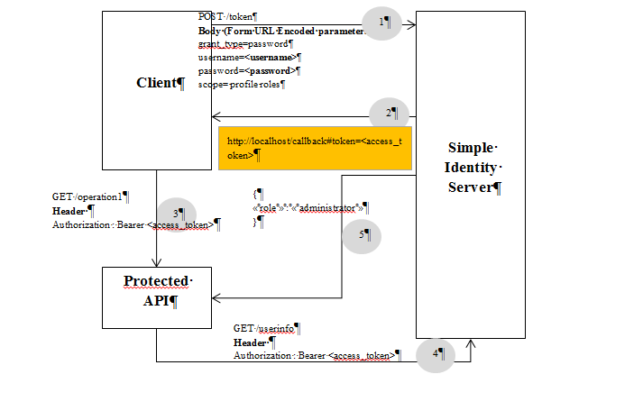
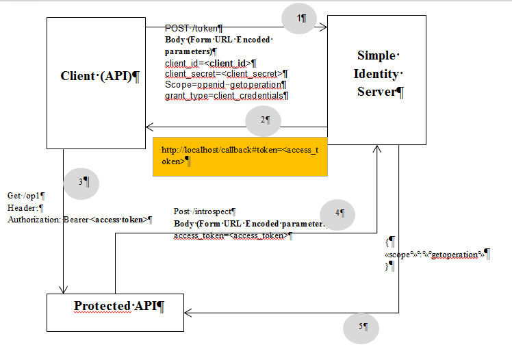
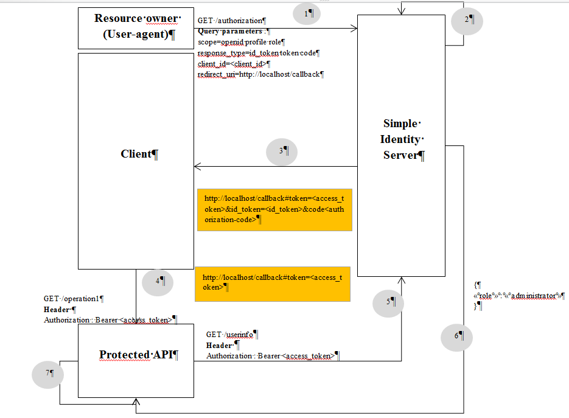

=================
OpenId / OAUTH2.0
=================

A client uses the authorization grant to obtain an access token, which is a string representing an authorization granted to the client by the resource owner.
The RFC-6749_ is talking about four different grant-types, but in reality there're five. An HybridFlow_ has been introduced by open-id.
We are going to explain the different flows by trying to implement the same scenario : 

A client wants to access to protected operations but only users with administrator role are allowed.
Protected API operations are expecting to receive HTTP request with access-token valids for the scope "role", it will be used later by the API to retrieve user's claims from the userinfo endpoint.

Authorization code flow
-----------------------

This flow is perfect when your client is a web-application. It has the benefit of not exposing any tokens to the User-Agents.
The difference between an access-token & the authorization code is their litetimes.
An authorization code has a very short-litetime and can only be used one time, however an access token can be used until its expiration date.
The flow is explained in the following schema :

**Steps** :

Assumptions : We assumed that the resource owner is already authenticated & the consent has already been confirmed by him.
 1. The user-agent is redirected to the authorization endpoint to get a code.
 2. Parameters are checked by Simple Identity Server.
 3. The authorization code is passed to the callback as a fragment and returned to the client.
 4. When the authorization code has been received, the client is using it to retrieve an access token.
 5. The access token is generated and returned to the client.
 6. The client is using the access token to access to protected operations.
 7. The protected API passed the access token to the userinfo request & gets the claims (role) back.
 8. Claims are returned by Simple Identity Server. They are used to limit the access to protected operations based on the roles.
 9. Claims are checked during the authorization phase.

Implicit flow
-------------

With the implicit flow you can choose between having an identity token or an access token & identity token.
In our scenario we are only interesting about retrieving an access token. 
The flow is explained in the following schema :

**Steps**:

Assumptions : We assumed that the resource owner is already authenticated & the consent has already been confirmed by him.
 1. The user-agent is redirected to the authorization endpoint to get an identity token & token
 2. Parameters are checked by Simple Identity Server.
 3. The identity token & token are passed to the callback as fragments and returned to the client.
 4. The client is using the access token to access to protected operations.
 5. The protected API passed the access token to the userinfo request & gets the claims (role) back.
 6. Claims are returned by Simple Identity Server.
 7. Claims are checked during the authorization phase.

Resource owner credentials flow
-------------------------------

Using this flow doesn't require resource owner's interaction. 
This approach can be chosen when the client is a desktop application (WPF) & if there's a trust relationship between the client and Simple Identity Server.
The flow is explained in the following schema :

**Steps** :

 1. Post the resource owner & client's credentials to the token endpoint.
 2. An access token valid for the scopes : profile & roles is returned to the client.
 3. Token is passed into the API request.
 4. The API is using the token to retrieve resource owner's claims from Simple Identity Server.
 5. Claims are returned.

Client credentials flow
-----------------------

The client-credentials flow has been introduced by OAUTH2.0. It's used to retrieve an access token valid for resource scopes.
The scenario explained above cannot be supported. In fact the access token cannot be valid for resource owner scopes such as : roles and profile.
This flow is used when the client is an API which wants to access to protected API operations.
the flow is explained in the following schema :

**Steps** :

 1. Post client credentials to token endpoint.
 2. An access token valid for getoperation is generated and returned to the client.
 3. Token is passed into the API request.
 4. The API is using the token to retrieve the token's claims from Simple Identity Server
 5. The valid scopes are returned to the client.

Hybrid flow
-----------

The hybrid flow is coming from the Open-Id concept, it's a mix between implicit & authorization code flows.
The client can ask in the same request an authorization code and any tokens.
The combinations below can be passed into the "response_type" parameter :
 * code id_token
 * code token
 * code id_token token

.. _RFC-6749: https://tools.ietf.org/html/rfc6749#section-1.3
.. _HybridFlow: http://openid.net/specs/openid-connect-core-1_0.html#HybridFlowAuth

