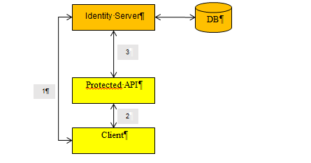

=============
Terminologies
=============

The open-id architecture is organized around several components_ :
* **Client** : An application which wants to execute an operation on a protected API
* **Protected API** : A REST.API service which protects operations and / or personal information
* **Resource Owner** : A user of the client. A protected API can contains personal information, a client which wants to access to the resource owner's information needs his consent.
* **Simple Identity Server** : An application which grants a client access to a protected API

Two different kinds of token can be requested from Simple Identity Server:
* **Access token** : An access token has a lifetime and is valid for certain scopes. It's used by the client to access to certain protected operation or to fetch resource owner's information from the "userinfo" endpoint.
* **Identity token** : Signed (Json Web Signature_) and / or encrypted (Json Web Encryption_) Javascript Web Token. It contains all the resource owner's claims.

We identified two different kinds of scopes :
* **Resource owner scope**: Used to retrieve a set of resource owner's claims. For example by using the scope *email* you can access to the claims "email" & "email_verified".
* **Protected Api Scope** : Used to protect API operation(s). For example an API operation can be protected against malicious HTTP request(s) which doesn't contain an access token valid for the scope "executeOperation".

The following schema shows the interactions between components. 
(1) The client which wants to access to certain API operations requests an access token from Simple Identity Server.
(2) An HTTP request with the access token passed in the Authorization header (Authorization : Bearer <access token>) is sent to the protected API.
(3) When the request is received a validation procedure is triggered, it sends a request to Simple Identity Server to check the access token validity and retrieve the scopes and / or resource owner's claims such as : name, email.

.. _components: http://openid.net/specs/openid-connect-core-1_0.html#Terminology
.. _Json Web Signature: https://tools.ietf.org/html/draft-ietf-jose-json-web-signature-41
.. _Json Web Encryption: https://tools.ietf.org/html/draft-ietf-jose-json-web-encryption-40